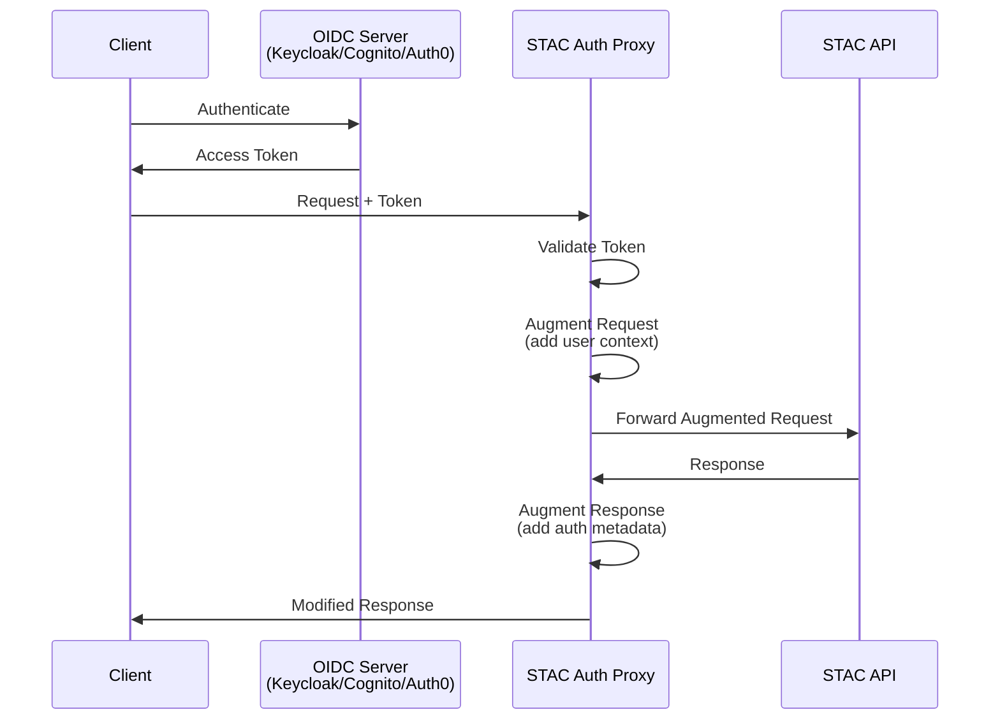
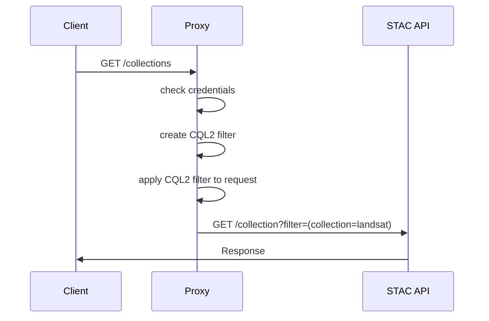
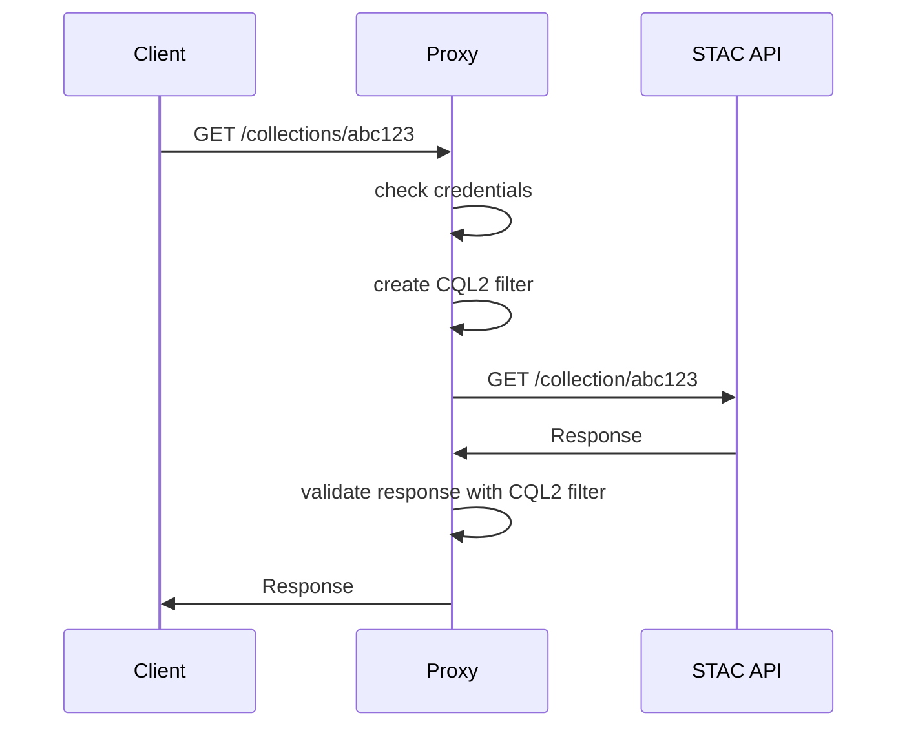

# Securing STAC APIs

::subtitle::
Auth Patterns and a Proxy-Based Approach

<DecorativeRectangle
  width="50%"
  height="40%"
  zIndex=20
  :position="{
    bottom: '2%',
    right: '2%',
  }"
  :customStyle="{ mixBlendMode: 'multiply' }"
>
  <div w-full h-full relative flex flex-col items-end justify-end p-4 text-white text-right>
    <h3 text-5xl mb-0>
      FOSS4G 2025
    </h3>
    <h4 mb-0>
      Auckland, NZ
    </h4>
    <h4 text-md font-mono mb-0>
      2025-11-20
    </h4>
    <h5 text-sm mb-0>
      <a href="//github.com/alukach">
        <code text-primary>@alukach</code>
      </a>
    </h5>
  </div>
</DecorativeRectangle>
<LogoHorPos position="top-left" height="24px" />

---
layout: image-right
# Landsat 8 Image of Ayon Island
# https://unsplash.com/photos/B-bXvd0R1bM
image: /images/theme/landsat8-ayon-island.jpg
class: image-narrow
---

# devseed ❤️ stac


<v-clicks>

* OGC supported standard (🎉)
* flexible via extensions
* well supported

</v-clicks>

<!--
I'm a Cloud Engineer with DevelopmentSeed

DevelopmentSeed is a consultancy focused on open data and open source software, with an affinity for geospatial data.

Working as a consultancy allows us to work with a number of partners and see a lot of different projects, which is a great position to be in when we try to build solutions to solve many peoples needs
-->

---
layout: image-right
image: /images/theme/landsat8-klyuchevskaya-kamchatka.jpg
class: image-narrow
---

# state of auth within stac

many strategies

- JWTs
- 🍪
- basic auth
- api tokens

<v-click>
choose your own adventure 🤷‍♂️</v-click>

<!--
We've seen various implementations for authentication with STAC APIs

Each of these required a custom solution to validate incoming requests and to enforce
unique needs
-->

---
layout: image-right
image: /images/theme/landsat9-bangladesh-coast.jpg
---

# common auth needs

<v-clicks>

1. route-level auth
2. record-level auth
3. asset-level access

</v-clicks>

<!--
we've identified three major groupings for auth needs

1. Situations where a company wants to keep their entire catalog private, or perhaps just the transaction endpoints have authorization requirements to ensure that only certain users are permitted to alter data
2. Situations where users are allowed to view data, but perhaps only a subset of the data in the catalog. This could be related to situations where users pay for access to data or where they can only view or edit data that they own
3. The final
-->

---
layout: iframe-right
url: https://developmentseed.org/stac-auth-proxy/
---

# enter: stac-auth-proxy

during this talk, we'll review these three auth scenarios and how we developed `stac-auth-proxy` to address these needs

---
layout: image-right
image: /images/satsummit-screenshot.png
---

# backstory

conceived at a casual "birds of a feather" during SatSummit Lisbon (2024)

---
layout: image-right
image: /images/theme/landsat9-taklimakan-desert-china.jpg
class: image-narrow
---

# why a proxy?

### many stac backends

- `stac-fastapi-pgstac` <small>(python + postgis)</small>
- `sfeos` <small>(python + elasticsearch/opensearch)</small>
- `stac-fastapi-geoparquet` <small>(python + geoparquet)</small>
- `franklin` <small>(scala + postgis)</small>
- `staccato` <small>(java + elasticsearch)</small>
- `stac-server` <small>(node + elasticsearch)</small>

<!--
any viable solution shouldn't require adopters to change their language/datastore
-->

---
layout: image-right
image: /images/theme/landsat9-western-guinea-bissau.jpg
class: image-narrow
---

# strategy

1. target most common needs
2. embrace for existing open standards
3. mininize configuration overhead via sensible defaults
4. usable as a standalone service or customizable with code

---
layout: image-right
image: /images/theme/satellite-image-body-of-water.jpg
class: image-narrow
---

# how does it work?





<!--
* application gateway in front of your STAC API
* integrates with OpenID Connect (OIDC) authentication servers (e.g. Keycloak, AWS Cognito, Auth0)
* validates incoming requests
* augments outgoing responses
-->

---
layout: image-right
image: /images/theme/sentinel2a-southern-tibetan-plateau.jpg
class: image-narrow
---

# *caveat:* not necessarily a proxy

Usable as a library of ASGI Middleware

````md magic-move

```py
pip install 'stac-auth-proxy'
```

```py {|2|4-7|8-12}
from fastapi import FastAPI
from stac_auth_proxy import configure_app

# Setup an ASGI-compliant API
app = FastAPI( 
  ... # configure API
)
# Apply middleware to API
configure_app(
  app, 
  ... # configure STAC Auth Proxy
)
```
````

<!--
STAC Auth Proxy is really just ~10 middleware classes in a trench coat.

If you would prefer to avoid running a separate service, you can also use the `configure_app` function to apply the middleware directly onto your STAC API

Admittedly, we've only tested this with FastAPI applications.
-->

---
layout: image-right
image: /images/theme/Tanezrouft_Basin.jpg
class: image-narrow
---

# how do we use it?

base-level of configuration

```dotenv {all|1|2|all}
UPSTREAM_URL=http://stac:8001
OIDC_DISCOVERY_URL=http://localhost:8888/.well-known/openid-configuration
```
<!-- 

when running as either a proxy application or as middleware, we lean on environment variables to configure. as middleware, these values can alternatively be provided by keyword arguments

we aim for _sensible-defaults_

 -->
---
layout: image-right
image: /images/theme/lena-delta.jpg
class: image-narrow
---

# route-level

* **intention:** limit access to STAC endpoints
* **use cases:**
  * private STAC APIs
  * guarded access to Transactions Extension

---
layout: image-right
image: /images/theme/lena-delta.jpg
class: image-narrow
---

# route-level auth configuration

````md magic-move
```dotenv {3}
UPSTREAM_URL=http://stac:8001
OIDC_DISCOVERY_URL=http://localhost:8888/.well-known/openid-configuration
DEFAULT_PUBLIC=true|false
```

```dotenv {3}
UPSTREAM_URL=http://stac:8001
OIDC_DISCOVERY_URL=http://localhost:8888/.well-known/openid-configuration
DEFAULT_PUBLIC=false
```

```dotenv {3-11}
UPSTREAM_URL=http://stac:8001
OIDC_DISCOVERY_URL=http://localhost:8888/.well-known/openid-configuration
DEFAULT_PUBLIC=false
# everything's private, except for non-data endpoints...
PUBLIC_ENDPOINTS={
  "^/$": ["GET"],
  "^/api.html$": ["GET"],
  "^/api$": ["GET"],
  "^/conformance$": ["GET"],
  "^/docs/oauth2-redirect": ["GET"],
  "^/healthz": ["GET"]
}
```

```dotenv {3}
UPSTREAM_URL=http://stac:8001
OIDC_DISCOVERY_URL=http://localhost:8888/.well-known/openid-configuration
DEFAULT_PUBLIC=true
```

```dotenv {3-11}
UPSTREAM_URL=http://stac:8001
OIDC_DISCOVERY_URL=http://localhost:8888/.well-known/openid-configuration
DEFAULT_PUBLIC=true
# everything's public, except for transactions-extension endpoints...
PRIVATE_ENDPOINTS={
  "^/collections$": ["POST"],
  "^/collections/([^/]+)$": ["PUT", "PATCH", "DELETE"],
  "^/collections/([^/]+)/items$": ["POST"],
  "^/collections/([^/]+)/items/([^/]+)$": ["PUT", "PATCH", "DELETE"],
  "^/collections/([^/]+)/bulk_items$": ["POST"]
}
```

```dotenv {3-11}
UPSTREAM_URL=http://stac:8001
OIDC_DISCOVERY_URL=http://localhost:8888/.well-known/openid-configuration
DEFAULT_PUBLIC=true
# PRIVATE_ENDPOINTS can be overridden to check for scope claims...
PRIVATE_ENDPOINTS={
  "^/collections$": [["POST", "stac:collection:create"]],
  "^/collections/([^/]+)$": [["PUT", "stac:collection:update"], ["PATCH", "stac:collection:update"], ["DELETE", "stac:collection:delete"]],
  "^/collections/([^/]+)/items$": [["POST", "stac:item:create"]],
  "^/collections/([^/]+)/items/([^/]+)$": [["PUT", "stac:item:update"], ["PATCH", "stac:item:update"], ["DELETE", "stac:item:delete"]],
  "^/collections/([^/]+)/bulk_items$": [["POST", "stac:item:create"]],
}
```
````

---
layout: image-right
image: /images/theme/landsat9-apostle-islands-lake-superior.jpg
class: image-narrow
---

# reuse:  [authentication extension](https://github.com/stac-extensions/authentication)[^1]


`GET /`

````md magic-move
```json
{
  ...
  "links": [
    ...
  ],
  "stac_extensions": [
    ...
  ]
}
```

```json{|9}
{
  ...
  "links": [
    ...
    {
      "rel": "data",
      "type": "application/json",
      "title": "Collections available for this Catalog",
      "href": "http://upstream-api/collections"
    },
  ]
}
```

```json {|9-10}
{
  ...
  "links": [
    ...
    {
      "rel": "data",
      "type": "application/json",
      "title": "Collections available for this Catalog",
      "href": "http://proxy-api/collections",
      "auth:refs": ["oidc"]
    },
  ]
}
```

```json
{
  ...
  "links": [
    ...
    {
      "rel": "data",
      "type": "application/json",
      "title": "Collections available for this Catalog",
      "href": "http://proxy-api/collections",
      "auth:refs": ["oidc"]
    },
  ],
  "auth:schemes": {
    "oidc": {
      "type": "openIdConnect",
      "openIdConnectUrl": "https://some-oidc-server/.well-known/openid-configuration"
    }
  }
}
```

```json
{
  ...
  "links": [
    ...
  ],
  "auth:schemes": {
    ...
  },
  "stac_extensions": [
    ...
  ]
}
```

```json
{
  ...
  "links": [
    ...
  ],
  "auth:schemes": {
    ...
  },
  "stac_extensions": [
    ...
    "https://stac-extensions.github.io/authentication/v1.1.0/schema.json"
  ],
}
```
````

[^1]: https://github.com/stac-extensions/authentication

<!--
a core principal of the STAC specification is its ability to describe itself.

-->

---
layout: image-right
image: /images/theme/landsat9-apostle-islands-lake-superior.jpg
class: image-narrow
---

# reuse: [openapi spec](https://github.com/stac-extensions/authentication)

````md magic-move
```
UPSTREAM_URL=http://stac:8001
OIDC_DISCOVERY_URL=http://localhost:8888/.well-known/openid-configuration
DEFAULT_PUBLIC=true
```

```{4}
UPSTREAM_URL=http://stac:8001
OIDC_DISCOVERY_URL=http://localhost:8888/.well-known/openid-configuration
DEFAULT_PUBLIC=true
OPENAPI_SPEC_ENDPOINT=/openapi.json
```

```json
{
  "openapi": "3.1.0",
  "info": {...},
  "paths": {
    ...
    "/collections": {
      "post": {
        "summary": "Create Collection",
        "description": ...,
        "operationId": ...,
        "requestBody": ...,
        "responses": ...,
        "tags": [...]
      }
    }
  },
  "components": {
    ...
  },
}
```

```json {14-16}
{
  "openapi": "3.1.0",
  "info": {...},
  "paths": {
    ...
    "/collections": {
      "post": {
        "summary": "Create Collection",
        "description": ...,
        "operationId": ...,
        "requestBody": ...,
        "responses": ...,
        "tags": [...],
        "security": [
          { "oidcAuth": [ ] }
        ]
      }
    }
  },
  "components": {
    ...
  },
}
```
````

---
layout: iframe
url: https://test.openveda.cloud/api/stac/docs
scale: 0.75
---

# reuse: [openapi spec](https://github.com/stac-extensions/authentication) (cont.)


---
layout: image-right
image: /images/theme/landsat9-apostle-islands-lake-superior.jpg
class: image-narrow
---

# record-level auth


* **intention:** only return authorizerd records (items/collections)
* **use cases:**
  * hiding "draft" data
  * exposing data via subscription model
  * multitenancy


---
layout: image-right
image: /images/theme/landsat9-apostle-islands-lake-superior.jpg
class: image-narrow
---

# record-level auth strategy

<v-switch>

<template #0>

1. generate CQL2 expressions based on request context
2. apply CQL2 filters via filters extension[^1]

</template>

<template #1>



</template>

<template #2>

<div style="transform: scale(0.83); transform-origin: top left;">



</div>

</template>

</v-switch>

[^1]: https://github.com/stac-api-extensions/filter


---
layout: image-right
image: /images/theme/landsat9-apostle-islands-lake-superior.jpg
class: image-narrow
---

# record-level auth configuration

````md magic-move

```dotenv
UPSTREAM_URL=http://stac:8001
OIDC_DISCOVERY_URL=http://localhost:8888/.well-known/openid-configuration
```

```dotenv {|3|4}
UPSTREAM_URL=http://stac:8001
OIDC_DISCOVERY_URL=http://localhost:8888/.well-known/openid-configuration
COLLECTIONS_FILTER_CLS=my_package.filters:MyCollectionsFilter
COLLECTIONS_FILTER_ARGS=["foo", "bar"]
```

```dotenv
UPSTREAM_URL=http://stac:8001
OIDC_DISCOVERY_URL=http://localhost:8888/.well-known/openid-configuration
COLLECTIONS_FILTER_CLS=my_package.filters:MyCollectionsFilter
COLLECTIONS_FILTER_ARGS=["foo", "bar"]
ITEMS_FILTER_CLS=my_package.filters:MyItemsFilter
ITEMS_FILTER_ARGS=["baz"]
```
````

---
layout: image-right
image: /images/theme/landsat9-apostle-islands-lake-superior.jpg
class: image-narrow
---

# record-level auth configuration

````md magic-move

```dotenv
UPSTREAM_URL=http://stac:8001
OIDC_DISCOVERY_URL=http://localhost:8888/.well-known/openid-configuration
```

```dotenv {|3|4}
UPSTREAM_URL=http://stac:8001
OIDC_DISCOVERY_URL=http://localhost:8888/.well-known/openid-configuration
COLLECTIONS_FILTER_CLS=my_package.filters:MyCollectionsFilter
COLLECTIONS_FILTER_ARGS=["foo", "bar"]
```

```dotenv
UPSTREAM_URL=http://stac:8001
OIDC_DISCOVERY_URL=http://localhost:8888/.well-known/openid-configuration
COLLECTIONS_FILTER_CLS=my_package.filters:MyCollectionsFilter
COLLECTIONS_FILTER_ARGS=["foo", "bar"]
ITEMS_FILTER_CLS=my_package.filters:MyItemsFilter
ITEMS_FILTER_ARGS=["baz"]
```
````


[^1]: https://github.com/stac-api-extensions/filter

---
layout: image-right
image: /images/theme/landsat9-apostle-islands-lake-superior.jpg
class: image-narrow
---

# record-level auth: filter factories


---
layout: image-right
image: /images/theme/landsat9-apostle-islands-lake-superior.jpg
class: image-narrow
---

# what's next?

* record-level auth for transactions endpoints
* asset-level access

---
layout: title
# Landsat 9 image of Apostle Islands, Lake Superior
# https://unsplash.com/photos/j7HqdQqn7Jo
image: /images/theme/landsat9-apostle-islands-lake-superior.jpg
---

# Thank you!

## Questions?

<DecorativeRectangle
  width="30%"
  height="96%"
  zIndex=11
  :position="{
    bottom: '2%',
    right: '2%',
  }"
  :customStyle="{ mixBlendMode: 'multiply' }"
>
  <div w-full h-full relative flex flex-col items-start justify-between p-4 text-white text-left class="[&_a]:no-underline [&_a]:text-white [&_a:hover]:text-gray-200">
    <div mb-4 flex flex-col gap-5 items-start justify-start text-sm font-mono class="[&_a]:flex [&_a]:items-center [&_a]:gap-1">
      <Logo src="/images/logos/hor--neg-mono@2x.png" height="24px" alt="DevelopmentSeed" class="!relative !top-0 !left-0" />
      <a href="mailto:anthony@developmentseed.org" title="Email">
        <EmailIcon size="20" pr-1 />
        <span>anthony@developmentseed.org</span>
      </a>
      <a href="https://github.com/alukach" target="_blank" title="GitHub">
        <GitHubIcon size="20" pr-1 />
        <span>@alukach</span>
      </a>
      <a href="https://www.linkedin.com/in/alukach" target="_blank" title="LinkedIn">
        <LinkedInIcon size="20" pr-1 />
        <span>in/alukach</span>
      </a>
      <!-- <a href="https://developmentseed.org/careers" target="_blank" class="font-sans" text-xs text-strong text-italics>
        <span pr-1>🚀</span>
        We're hiring!
      </a> -->
      <CurrentUrlQRCode
        fullWidth
        image='/images/logos/symbol--neg-mono@2x.png'
        :dotsOptions="{ type: 'classy-rounded', color: 'white' }"
      />
    </div>
    <div opacity-70 w-100 class="text-[10px]">
      <div>Attributions:</div>
      <div>
        Slide images from <a href="https://unsplash.com/@usgs?utm_source=ds-slides&utm_medium=referral" target="_blank" class="text-white hover:text-gray-200">USGS</a> on <a href="https://unsplash.com/?utm_source=ds-slides&utm_medium=referral">Unsplash</a>
      </div>
    </div>
  </div>
</DecorativeRectangle>
