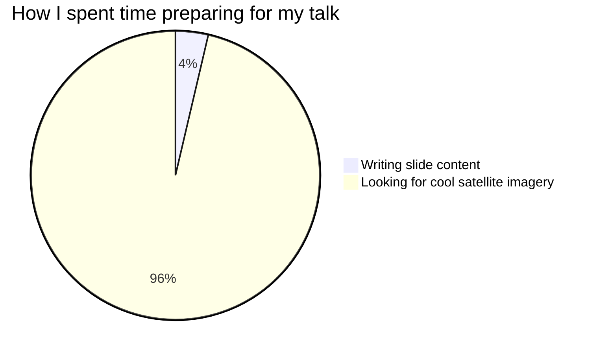

<LogoHorPos position="top-left" height="24px" />

# DevelopmentSeed Slidev Theme


::subtitle::
A showcase of layouts, components, and features

<DecorativeRectangle
  width="50%"
  height="40%"
  zIndex=20
  :position="{
    bottom: '2%',
    right: '2%',
  }"
  :customStyle="{ mixBlendMode: 'multiply' }"
>
  <!-- You can place content _inside_ of rectangles! -->
  <div w-full h-full relative flex flex-col items-end justify-end p-4 text-white text-right>
    <h3 text-5xl>
      Your Event
    </h3>
    <h4 text-md font-mono>
      2025-01-15
    </h4>
    <h5 text-sm>
      <code text-primary>@presenter</code>
    </h5>
  </div>
</DecorativeRectangle>

<LogoHorNegMono position="bottom-center" />

---
layout: image-right
class: bg-black text-white m-10
image: /images/theme/usgs-08hjz7VzB84-unsplash.png
---

# Theme Features

* Custom brand colors
* Roboto typography
* Flexible layouts
* Decorative components

> Minimal theme, maximum impact

<DecorativeRectangle
  width="35%"
  height="50%"
  zIndex=10
  :position="{
    bottom: '10%',
    right: '5%',
  }"
  :customStyle="{ mixBlendMode: 'saturation' }"
/>

<DecorativeRectangle
  width="35%"
  height="50%"
  zIndex=10
  :position="{
    top: '15%',
    right: '15%',
  }"
  :customStyle="{ mixBlendMode: 'color-burn' }"
/>

<LogoHorNegMono position="bottom-right" />

<!-- Also supports notes that are displayed in the presenter view. Just make sure that the comment is places at the END of the slide (after logo/rectangles) -->


---
layout: image-left
image: https://images.unsplash.com/photo-1722080768196-8983bbbb5c0f
---

# Click Animations

<v-click>

### Use `v-click` for progressive disclosure
</v-click>

<v-click>

* First bullet appears
* Second bullet appears
* Third bullet appears
</v-click>

<v-click>

> Perfect for revealing complex information step-by-step
</v-click>

<v-click>

[📔 Docs](https://sli.dev/guide/animations)
</v-click>


<DecorativeRectangle
  width="50%"
  height="40%"
  zIndex=10
  :position="{
    bottom: '2%',
    left: '1%',
  }"
  :customStyle="{ mixBlendMode: 'difference' }"
/>

<LogoHorNegMono position="bottom-left" />

---
layout: image-left
image: https://images.unsplash.com/photo-1744968776900-311abae36ead
class: image-narrow
---

<DecorativeRectangle
  width="55%"
  height="2em"
  zIndex=10
  :position="{
    top: '5em',
    left: '16em',
  }"
  :customStyle="{ mixBlendMode: 'multiply' }"
/>

# V-Mark Features

## Highlight and cross-off text

Use `v-mark` + [Rough Notation](https://roughnotation.com/) to draw attention or indicate rejected options:

- `v-mark.highlight.orange` - <span v-mark.highlight.orange>Highlight text and <code>code</code></span>
- `v-mark.crossed-off` - <span v-mark.crossed-off>Cross off text</span>
- `v-mark.strike-through` - <span v-mark.strike-through>Strike through text</span>
- `v-mark.circle` - <span v-mark.circle>Circle text</span>
- `v-mark.underline` - <span v-mark.underline>Underline text</span>

[📔 Docs](https://sli.dev/features/rough-marker.html)

<LogoHorNegMono position="bottom-left" />

---
layout: image-right
image: https://images.unsplash.com/photo-1722083854982-2f1516cf263c
---

# Lists & Styling

- Styled unordered lists
  - Proper spacing
    - Nested list support
- Orange bullet points

1. We count
2. And keep counting...
   1. And count separately
   2. And more!
      1. It doesn't stop!
3. Until we're finished.


<DecorativeRectangle
  width="55%"
  height="2em"
  zIndex=10
  :position="{
    top: '3em',
    left: '2em',
  }"
  :customStyle="{ mixBlendMode: 'multiply' }"
/>

<LogoHorNegMono position="bottom-right" />

---
layout: image-left
image: https://images.unsplash.com/photo-1722082839868-d900d1a07e69
class: image-narrow
---

# Layouts

We use `image-left` and `image-right` layouts for the majority of these slides, with optional `image-narrow` class for 1/3 width images.

Beyond that, consider the `cover` and `title` layouts along with all the other layouts described in the docs.

[📔 Docs](https://sli.dev/guide/layout)


<DecorativeRectangle
  width="40%"
  height="30%"
  zIndex=10
  :position="{
    bottom: '1%',
    left: '-5%',
  }"
  :customStyle="{ mixBlendMode: 'difference' }"
/>

<LogoHorNegMono position="bottom-left" />


---
layout: iframe-right
url: https://developmentseed.org/
---

# Iframe Layout

### Embed External Content

The `iframe-right` layout lets you display external websites alongside your content.

Perfect for:
- Documentation references
- Live demos
- Interactive examples

**Note:**

* Seems to open website in a mobile-layout
* Doesn't work with github.com! 😿

<DecorativeRectangle
  width="30%"
  height="20%"
  zIndex=10
  :position="{
    top: '-5%',
    left: '19%',
  }"
  :customStyle="{ mixBlendMode: 'multiply' }"
/>

<LogoHorNegMono position="bottom-right" />

---
layout: image-left
class: image-narrow
image: https://images.unsplash.com/photo-1722080767795-af488166033d
---


# Decorative Rectangles


<div mb-5 />

## Slide feeling boring? 

<div mb-5 />

**💥SLAP A RECTANGLE ON IT!🟧✨**

<div mb-5 />

```vue
<DecorativeRectangle
  width="15em"
  height="15em"
  zIndex=10
  :position="{
    top: '4em',
    left: '7em',
  }"
  :customStyle="{ mixBlendMode: 'multiply' }"
/>
```

Play around with the [`mix-blend-mode`](https://developer.mozilla.org/en-US/docs/Web/CSS/mix-blend-mode#syntax)

<DecorativeRectangle
  width="15em"
  height="15em"
  zIndex=10
  :position="{
    top: '8em',
    left: '7em',
  }"
  :customStyle="{ mixBlendMode: 'multiply' }"
/>

<DecorativeRectangle
  width="15em"
  height="15em"
  zIndex=10
  :position="{
    bottom: '1em',
    left: '-3.5em',
  }"
  :customStyle="{ mixBlendMode: 'difference' }"
/>

<LogoHorNegMono position="bottom-left" />
---
layout: image-left
image: /images/theme/lena-delta.jpg
class: image-narrow
---

# Magic Move

Animate code transitions smoothly

````md magic-move
```json
{
  "id": "product-123",
  "name": "Widget",
  "price": 29.99
}
```
```json
{
  "id": "product-123",
  "name": "Premium Widget",
  "price": 39.99,
  "category": "electronics",
  "inStock": true
}
```
````

[📔 Docs](https://sli.dev/features/shiki-magic-move)


<DecorativeRectangle
  width="34%"
  height="60%"
  :position="{
    bottom: '10px',
    left: '1%',
  }"
  zIndex="1"
  :customStyle="{ mixBlendMode: 'difference' }"
/>
<LogoHorNegMono position="bottom-left" />

---
layout: image-right
image: /images/theme/iceberg-scoresby-sund.jpg
class: image-narrow
---

## Synchronized Animations

Magic-move with v-mark highlighting

````md magic-move
```json
```
```json
// 1 - Client request
GET /api/products/search
```
```json
// 2 - Parse parameters
{
  "path": "/api/products/search",
  "query": "laptops"
}
```
```json
// 3 - Build search query
{
  "path": "/api/products/search",
  "query": "laptops",
  "filter": "category = electronics AND type = laptop"
}
```
```json
// 4 - Add to request
{
  "path": "/api/products/search?filter=category = electronics",
  "query": "laptops",
  "filter": "category = electronics AND type = laptop"
}
```
```json
// 5 - Execute database query
SELECT * FROM products WHERE category = 'electronics' AND type = 'laptop'
```
````

1. <span v-mark.highlight.orange="{ at: 1, to: 2 }">Client sends request</span>
2. <span v-mark.highlight.orange="{ at: 2, to: 3 }">Parse query parameters</span>
3. <span v-mark.highlight.orange="{ at: 3, to: 4 }">Build search filter</span>
4. <span v-mark.highlight.orange="{ at: 4, to: 5 }">Append to request</span>
5. <span v-mark.highlight.orange="{ at: 5 }">Execute against database</span>


<DecorativeRectangle
  width="40%"
  height="40%"
  zIndex=10
  :position="{
    top: '5%',
    right: '-5%',
  }"
  :customStyle="{ mixBlendMode: 'difference' }"
/>

<LogoHorNegMono position="bottom-right" />
---
layout: cover
background: '/images/theme/Tanezrouft_Basin.jpg'
class: px-5
---

<DecorativeRectangle
  width="40%"
  height="90%"
  :position="{
    bottom: '2%',
    right: '1%',
  }"
  :customStyle="{ mixBlendMode: 'color-burn' }"
/>

# Code Highlighting

## Line-by-Line Focus

```python [filename.py] {all|5|8|9-10|all}
@dataclasses.dataclass
class DataProcessor:
    """Process data with configurable filters"""

    async def __call__(self, context: dict[str, Any]) -> str:
        """Apply processing based on context parameters"""
        logger.debug("Processing with context %s", context)
        filter_type = context.get("filter")
        if filter_type:
            return f"filter: {filter_type}"
        return "default"

```

<LogoHorNegMono position="bottom-right" />


---
layout: cover
background: '/images/theme/Tanezrouft_Basin.jpg'
class: px-10
---

### Monaco Editor

Interactive code with live execution

<DecorativeRectangle
  width="30%"
  height="95%"
  :position="{
    top: '2%',
    right: '1%',
  }"
  :customStyle="{ mixBlendMode: 'color-burn' }"
/>

```ts {monaco-run} {autorun:true}
/**
 * Fetch GitHub repositories for an organization
 */
async function fetchRepositories(org: string = 'developmentseed') {
  const url = `https://api.github.com/orgs/${org}/repos?per_page=5&sort=updated`;
  console.log(`Fetching ${url}...`)
  const response = await fetch(url);
  const data = await response.json();
  console.log(`Found ${data.length} repositories`)
  if (!data.length) return console.log('No repositories found')
  for (const repo of data) {
    console.log(` - ${repo.name} (⭐ ${repo.stargazers_count})`);
  }
}

await fetchRepositories();
```

<LogoHorNegMono position="top-right" />

<!-- NOTE: Monaco's interactive code runner does NOT play well with presenter mode. If you are presenting and want to do live code edits, do those edits on the shared screen, not in the presenter's view -->


---
layout: image-left
image: https://images.unsplash.com/photo-1744968776986-3deb08e40a24
class: image-narrow
---

# Mermaid Diagrams



[📔 Docs](https://docs.mermaidchart.com/mermaid-oss/intro/index.html)

<DecorativeRectangle
  width="35%"
  height="40%"
  zIndex=10
  :position="{
    bottom: '2%',
    left: '1%',
  }"
  :customStyle="{ mixBlendMode: 'multiply' }"
/>
<LogoHorNegMono position="bottom-left" />


---
layout: title
image: https://images.unsplash.com/photo-1722080767251-aad7fa1796d3
---

<h1 text-6xl>Thank you!</h1>

<DecorativeRectangle
  width="30%"
  height="90%"
  zIndex=11
  :position="{
    bottom: '2%',
    right: '0%',
  }"
  :customStyle="{ mixBlendMode: 'multiply' }"
>
  <div w-full h-full relative flex flex-col items-start justify-between p-4 text-white text-left class="[&_a]:no-underline [&_a]:text-white [&_a:hover]:text-gray-200">
    <div mb-4 flex flex-col gap-5 items-start justify-start text-sm font-mono class="[&_a]:flex [&_a]:items-center [&_a]:gap-1">
      <Logo src="/images/logos/hor--neg-mono@2x.png" height="24px" alt="DevelopmentSeed" class="!relative !top-0 !left-0" />
      <a href="https://developmentseed.org" target="_blank" title="Website">
        <WebsiteIcon size="20" pr-1 />
        <span>developmentseed.org</span>
      </a>
      <a href="mailto:hello@developmentseed.org" title="Email">
        <EmailIcon size="20" pr-1 />
        <span>hello@developmentseed.org</span>
      </a>
      <a href="https://github.com/developmentseed" target="_blank" title="GitHub">
        <GitHubIcon size="20" pr-1 />
        <span>@developmentseed</span>
      </a>
      <a href="https://www.linkedin.com/company/development-seed" target="_blank" title="LinkedIn">
        <LinkedInIcon size="20" pr-1 />
        <span>development-seed</span>
      </a>
      <!-- <a href="https://developmentseed.org/careers" target="_blank" class="font-sans" text-xs text-strong text-italics>
        <span pr-1>🚀</span>
        We're hiring!
      </a> -->
    </div>
    <div opacity-70 w-100 class="text-[10px]">
      <div>Attributions:</div>
      <div>
        Slide images from <a href="https://unsplash.com/@usgs?utm_source=ds-slides&utm_medium=referral" target="_blank" class="text-white hover:text-gray-200">USGS</a> on <a href="https://unsplash.com/?utm_source=ds-slides&utm_medium=referral">Unsplash</a>
      </div>
    </div>
  </div>
</DecorativeRectangle>

