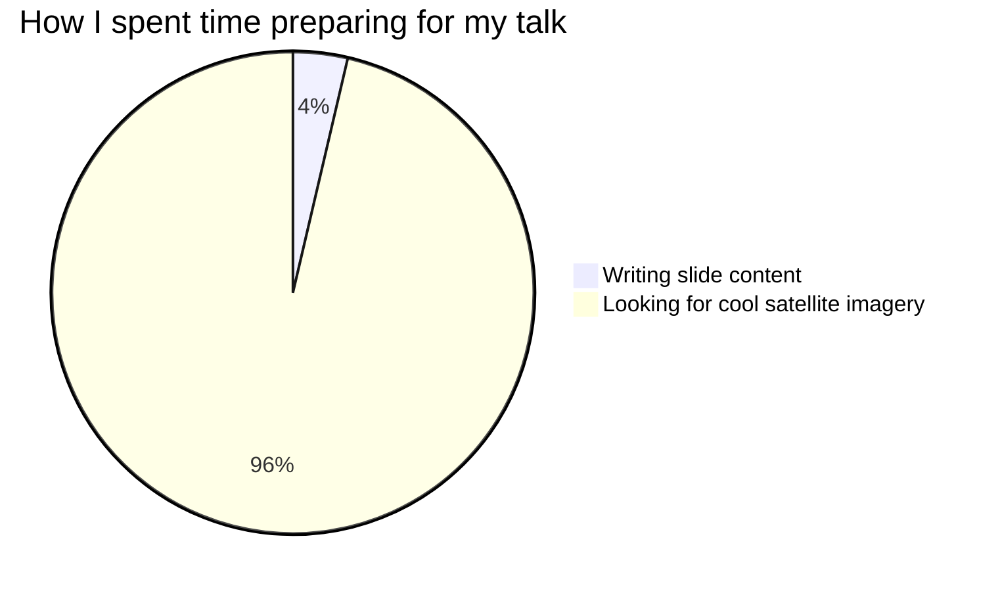

# Securing STAC APIs

::subtitle::
Auth Patterns and a Proxy-Based Approach

<DecorativeRectangle
  width="50%"
  height="40%"
  zIndex=20
  :position="{
    bottom: '2%',
    right: '2%',
  }"
  :customStyle="{ mixBlendMode: 'multiply' }"
>
  <div w-full h-full relative flex flex-col items-end justify-end p-4 text-white text-right>
    <h3 text-5xl>
      FOSS4G 2025
    </h3>
    <h4>
      Auckland, NZ
    </h4>
    <h4 text-md font-mono>
      2025-11-20
    </h4>
    <h5 text-sm>
      <a href="//github.com/alukach">
        <code text-primary>@alukach</code>
      </a>
    </h5>
  </div>
</DecorativeRectangle>
<LogoHorPos position="top-left" height="24px" />

---
layout: image-right
# Landsat 8 Image of Ayon Island
# https://unsplash.com/photos/B-bXvd0R1bM
image: /images/theme/landsat8-ayon-island.jpg
class: image-narrow
---

# about me

cloud engineer @ developmentseed

<LogoHorNegMono position="bottom-right" />

<!-- Also supports notes that are displayed in the presenter view. Just make sure that the comment is places at the END of the slide (after logo/rectangles) -->


---
layout: image-right
# Landsat 9 Image of Kangerdlugssuaq Glacier, Greenland
# https://unsplash.com/photos/PgL1p8TBGNQ
image: /images/theme/landsat9-kangerdlugssuaq-greenland.jpg
class: image-narrow
---

# Click Animations

<v-click>

### Use `v-click` for progressive disclosure
</v-click>

<v-click>

* First bullet appears
* Second bullet appears
* Third bullet appears
</v-click>

<v-click>

> Perfect for revealing complex information step-by-step
</v-click>

<v-click>

[📔 Docs](https://sli.dev/guide/animations)
</v-click>

<LogoHorNegMono position="bottom-left" />

---
layout: image-left
# Landsat 8 image of Klyuchevskaya, Kamchatka Peninsula, Siberia, Russia
# https://unsplash.com/photos/yMcULenXoik
image: /images/theme/landsat8-klyuchevskaya-kamchatka.jpg
class: image-narrow
---

# V-Mark Features

## Highlight and cross-off text

Use `v-mark` + [Rough Notation](https://roughnotation.com/) to draw attention or indicate rejected options:

- `v-mark.highlight.orange` - <span v-mark.highlight.orange>Highlight text and <code>code</code></span>
- `v-mark.crossed-off` - <span v-mark.crossed-off>Cross off text</span>
- `v-mark.strike-through` - <span v-mark.strike-through>Strike through text</span>
- `v-mark.circle` - <span v-mark.circle>Circle text</span>
- `v-mark.underline` - <span v-mark.underline>Underline text</span>

[📔 Docs](https://sli.dev/features/rough-marker.html)

<LogoHorNegMono position="bottom-left" />

---
layout: image-right
# Fjords in southeastern coast of Greenland
# https://unsplash.com/photos/blue-white-and-red-abstract-painting-3O2HJPzgkQY
image: /images/theme/blue-white-red-abstract-painting.jpg
---

# Lists & Styling

- Styled unordered lists
  - Proper spacing
    - Nested list support
- Orange bullet points

1. We count
2. And keep counting...
   1. And count separately
   2. And more!
      1. It doesn't stop!
3. Until we're finished.

<LogoHorNegMono position="bottom-right" />

---
layout: image-left
# Landsat 9 Image of Prudhoe Bay, Alaska
# https://unsplash.com/photos/a-satellite-image-of-a-body-of-water-F8BGGoayfeQ
image: /images/theme/satellite-image-body-of-water.jpg
class: image-narrow
---

# Layouts

We use `image-left` and `image-right` layouts for the majority of these slides, with optional `image-narrow` class for 1/3 width images.

Beyond that, consider the `cover` and `title` layouts along with all the other layouts described in the docs.

[📔 Docs](https://sli.dev/guide/layout)

<LogoHorNegMono position="bottom-left" />

---
layout: iframe-right
url: https://developmentseed.org/
---

# Iframe Layout

### Embed External Content

The `iframe-right` layout lets you display external websites alongside your content.

Perfect for:
- Documentation references
- Live demos
- Interactive examples

**Note:**

* Seems to open website in a mobile-layout
* Doesn't work with github.com! 😿

<LogoHorNegMono position="bottom-right" />

---
layout: image-left
class: image-narrow
# Landsat 9 Image of Taklimakan Desert, China
# https://unsplash.com/photos/KGzlTHjkyZM
image: /images/theme/landsat9-taklimakan-desert-china.jpg
---

# Decorative Rectangles

## Slide feeling boring? 

**💥SLAP A RECTANGLE ON IT!🟧✨**

```vue
<DecorativeRectangle
  width="15em"
  height="10rem"
  zIndex=10
  :position="{
    top: '4em',
    left: '7em',
  }"
  :customStyle="{ mixBlendMode: 'multiply' }"
/>
```

Play around with the [`mix-blend-mode`](https://developer.mozilla.org/en-US/docs/Web/CSS/mix-blend-mode#syntax)

<DecorativeRectangle
  width="23em"
  height="10rem"
  zIndex=10
  :position="{
    bottom: '2%',
    left: '-1em',
  }"
  :customStyle="{ mixBlendMode: 'multiply' }"
/>
<LogoHorNegMono position="bottom-left" />
---
layout: image-left
image: /images/theme/lena-delta.jpg
class: image-narrow
---

# Magic Move

Animate code transitions smoothly

````md magic-move
```json
{
  "id": "product-123",
  "name": "Widget",
  "price": 29.99
}
```
```json
{
  "id": "product-123",
  "name": "Premium Widget",
  "price": 39.99,
  "category": "electronics",
  "inStock": true
}
```
````

[📔 Docs](https://sli.dev/features/shiki-magic-move)


<LogoHorNegMono position="bottom-left" />

---
layout: image-right
# Sentinel-2A image of the Southern Tibetan Plateau
# image: https://images.unsplash.com/photo-1536227019771-b2eac2dd6121
image: /images/theme/sentinel2a-southern-tibetan-plateau.jpg
class: image-narrow
---

## Synchronized Animations

Magic-move with v-mark highlighting

````md magic-move
```json
```
```json
// 1 - Client request
GET /api/products/search
```
```json
// 2 - Parse parameters
{
  "path": "/api/products/search",
  "query": "laptops"
}
```
```json
// 3 - Build search query
{
  "path": "/api/products/search",
  "query": "laptops",
  "filter": "category = electronics AND type = laptop"
}
```
```json
// 4 - Add to request
{
  "path": "/api/products/search?filter=category = electronics",
  "query": "laptops",
  "filter": "category = electronics AND type = laptop"
}
```
```json
// 5 - Execute database query
SELECT * FROM products WHERE category = 'electronics' AND type = 'laptop'
```
````

1. <span v-mark.highlight.orange="{ at: 1, to: 2 }">Client sends request</span>
2. <span v-mark.highlight.orange="{ at: 2, to: 3 }">Parse query parameters</span>
3. <span v-mark.highlight.orange="{ at: 3, to: 4 }">Build search filter</span>
4. <span v-mark.highlight.orange="{ at: 4, to: 5 }">Append to request</span>
5. <span v-mark.highlight.orange="{ at: 5 }">Execute against database</span>

<LogoHorNegMono position="bottom-right" />

---
layout: cover
# Copernicus Sentinel-2 image of Tanezrouft Basin, Sahara, southern Algeria and northern Mali
# https://en.wikipedia.org/wiki/Tanezrouft#/media/File:Tanezrouft_Basin_ESA22416295.jpeg
background: '/images/theme/Tanezrouft_Basin.jpg'
class: px-5
---

# Code Highlighting

Line-by-Line Focus

```python [filename.py] {all|5|8|9-10|all}
@dataclasses.dataclass
class DataProcessor:
    """Process data with configurable filters"""

    async def __call__(self, context: dict[str, Any]) -> str:
        """Apply processing based on context parameters"""
        logger.debug("Processing with context %s", context)
        filter_type = context.get("filter")
        if filter_type:
            return f"filter: {filter_type}"
        return "default"

```

<LogoHorNegMono position="bottom-right" />


---
layout: cover
# Landsat 9 image of Bangladesh Coast
# https://unsplash.com/photos/eGGENWtikd0
background: img:landsat9-bangladesh-coast
class: px-10
---

### Monaco Editor

Interactive code with live execution

```ts {monaco-run} {autorun:true}
/**
 * Fetch GitHub repositories for an organization
 */
async function fetchRepositories(org: string = 'developmentseed') {
  const url = `https://api.github.com/orgs/${org}/repos?per_page=5&sort=updated`;
  console.log(`Fetching ${url}...`)
  const response = await fetch(url);
  const data = await response.json();
  console.log(`Found ${data.length} repositories`)
  if (!data.length) return console.log('No repositories found')
  for (const repo of data) {
    console.log(` - ${repo.name} (⭐ ${repo.stargazers_count})`);
  }
}

await fetchRepositories();
```

<LogoHorNegMono position="top-right" />

<!-- NOTE: Monaco's interactive code runner does NOT play well with presenter mode. If you are presenting and want to do live code edits, do those edits on the shared screen, not in the presenter's view -->

---
layout: image-left
# Landsat 8 image of the Ord River in Australia
# https://unsplash.com/photos/2BThgnOYoIc
image: /images/theme/landsat8-ord-river-australia.jpg
class: image-narrow
---

# Mermaid Diagrams



[📔 Docs](https://docs.mermaidchart.com/mermaid-oss/intro/index.html)

<LogoHorNegMono position="bottom-left" />

---
layout: image-right
# Landsat 9 Image of Western Guinea-Bissau
# https://unsplash.com/photos/ZuN44o80Bn0
image: /images/theme/landsat9-western-guinea-bissau.jpg
class: image-narrow
---

# QR Code Component

<div text-xs>

Dynamic QR codes powered by [`slidev-addon-qrcode`](https://github.com/kravetsone/slidev-addon-qrcode)


```jsx
<CurrentUrlQRCode />
<CurrentUrlQRCode includeSlideNumber/>
<CurrentUrlQRCode 
  width="100" height="100" 
  image='/images/logos/symbol--pos-neg@2x.png'
  url="https://developmentseed.org"
  :dotsOptions="{ 
    type: 'dots', 
    color: 'var(--slidev-theme-primary)' 
  }"
/>
```

</div>

<div flex gap-4>
<CurrentUrlQRCode  />
<CurrentUrlQRCode  includeSlideNumber/>
<CurrentUrlQRCode
  width="100" height="100" 
  image='/images/logos/symbol--pos-neg@2x.png'
  url="https://developmentseed.org"
  :dotsOptions="{ 
    type: 'dots', 
    color: 'var(--slidev-theme-primary)' 
  }"
/>
</div>


<LogoHorNegMono position="bottom-right" />

---
layout: title
# Landsat 9 image of Apostle Islands, Lake Superior
# https://unsplash.com/photos/j7HqdQqn7Jo
image: /images/theme/landsat9-apostle-islands-lake-superior.jpg
---

# Thank you!

<DecorativeRectangle
  width="30%"
  height="96%"
  zIndex=11
  :position="{
    bottom: '2%',
    right: '2%',
  }"
  :customStyle="{ mixBlendMode: 'multiply' }"
>
  <div w-full h-full relative flex flex-col items-start justify-between p-4 text-white text-left class="[&_a]:no-underline [&_a]:text-white [&_a:hover]:text-gray-200">
    <div mb-4 flex flex-col gap-5 items-start justify-start text-sm font-mono class="[&_a]:flex [&_a]:items-center [&_a]:gap-1">
      <Logo src="/images/logos/hor--neg-mono@2x.png" height="24px" alt="DevelopmentSeed" class="!relative !top-0 !left-0" />
      <a href="https://developmentseed.org" target="_blank" title="Website">
        <WebsiteIcon size="20" pr-1 />
        <span>developmentseed.org</span>
      </a>
      <a href="mailto:hello@developmentseed.org" title="Email">
        <EmailIcon size="20" pr-1 />
        <span>hello@developmentseed.org</span>
      </a>
      <a href="https://github.com/developmentseed" target="_blank" title="GitHub">
        <GitHubIcon size="20" pr-1 />
        <span>@developmentseed</span>
      </a>
      <a href="https://www.linkedin.com/company/development-seed" target="_blank" title="LinkedIn">
        <LinkedInIcon size="20" pr-1 />
        <span>development-seed</span>
      </a>
      <!-- <a href="https://developmentseed.org/careers" target="_blank" class="font-sans" text-xs text-strong text-italics>
        <span pr-1>🚀</span>
        We're hiring!
      </a> -->
      <CurrentUrlQRCode
        fullWidth
        image='/images/logos/symbol--neg-mono@2x.png'
        :dotsOptions="{ type: 'classy-rounded', color: 'white' }"
      />
    </div>
    <div opacity-70 w-100 class="text-[10px]">
      <div>Attributions:</div>
      <div>
        Slide images from <a href="https://unsplash.com/@usgs?utm_source=ds-slides&utm_medium=referral" target="_blank" class="text-white hover:text-gray-200">USGS</a> on <a href="https://unsplash.com/?utm_source=ds-slides&utm_medium=referral">Unsplash</a>
      </div>
    </div>
  </div>
</DecorativeRectangle>
